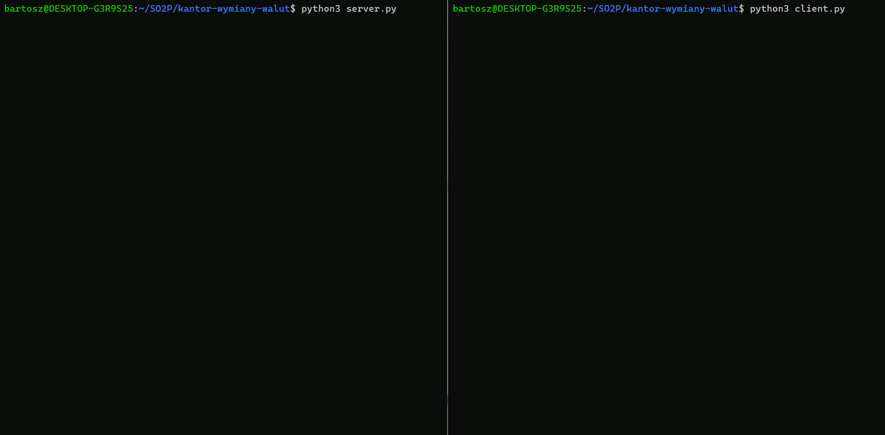

# Kantor wymiany walut
Systemy Operacyjne 2 - Projekt 

Politechnika Wrocławska, Wydział Informatyki i Telekomunikacji

Prowadzący -  [Mgr inż. Tomasz Szandała](https://github.com/szandala) 

Autorzy - [Łukasz Czerwiec](https://github.com/PuXter), [Bartosz Szymczak](https://github.com/PewPewBartula)

**Skąd taki pomysł na projekt?**:
W ramach prjektu chcieliśmy stworzyć aplikację, która miałaby realne zastosowanie jako wsparcie określonej firmy. Dodatkowo, jako przyszli zaawansowani informatycy, chcieliśmy przyzwyczaić się do obsługiwania wielwalutowych kont z pokaźnym stanem salda. 

**Założenia programu**:
- Aplikacja służy do prostej symulacji wymiany walut w oparciu o wątki
- Wykorzystane zostały proste aplikacje serwera i klienta, komunikujące się ze sobą za pomocą socketów
- Klient posiada saldo z określonymi walutami, jest w stanie podać rodzaj i ilość waluty do przeliczenia
- Jeden wątek jest odpowiedzialny za pobranie danych o walutach z [Narodowego Banku Polskiego](https://www.nbp.pl/home.aspx?f=/kursy/kursya.html) i losowe przekształcanie ich 
- Drugi wątek jest odpowiedzialny za obsługę klienta
- Obsługa sekcji krytycznej odbywa się za pomocą semaforu, który ogranicza liczbę klientów, która może się połączyć z serwerem
- Aplikacja została napisana w języku Python

# Demo

# Dokumentacja

W celu uruchomienia aplikacji należy uruchomić początkowo plik server.py w celu uruchomienia serwera, a następnie uruchomić plik client.py z innego terminala aby połączyć się z uruchomionym serwerem. Następnie w aplikacji klienta ukazują się informacje na temat funkcji. Aplikacja serwera w trakcie działania będzie wyświetlać informacje o ilości podłączonych klientów oraz o wymianie danych pomiędzy serwerem i klientem.

**currency.py**:
- Plik currency.py zawiera definicje klas odpowiedzialnych za pobieranie i reprezentacje walut, używanych w aplikacji klienta i serwera. Klasa CurrencyData zawiera metody odpowiedzialne za pobieranie danych o walutach ze strony Narodowego Banku Polskiego używając tzw. web scrapingu. Dane przechowywane są w tablicy currencies. Klasa Currency zawiera strukturę waluty, składająca się z atrybutów identycznych jak widnieją na stronie banku. Klasa SimpleCurrecny zawiera strukturę uproszczonej waluty używanej po stronie klienta do przeliczania walut. Klasa Balance zawiera strukturę walut znajdujących się na saldzie klienta.

**server.py**:
- Plik server.py zawiera funkcje odpowidzialne za uruchomienie serwera, nasłuchiwanie połączeń oraz obsługę połączonych klientów. Serwer po uruchomieniu sprawdza ile aktualnie klientów jest połączonych. Jeśli ich liczba jest mniejsza niż maksymalna to uruchamiany jest wątek obsługi klienta z flagą zezwalającą na połączenie. W przeciwnym wypadku uruchamiany jest on z flagą nie pozwalającą na połaczenie. Funkcja obsługi klientów, w przypadku flagi is_ok ustawionej na fałsz wysyła informację dla klienta o odrzuceniu połączenia, po czym zamyka połączenie. Jeśli flaga ta jest ustawiona na true, rozpoczyna się nasłuchiwanie nadchodzących wiadomości. W zależności od treści wiadomości uruchamiane są dane funkcjonalności.

**client.py**:
- Plik client.py zawiera funkcje odpowiedzialne za obsługę połączenia z serwerem, obsługę wiadomości z serwera oraz obsługę salda. Po uruchomieniu aplikacji serwera, uruchomienie aplikacji klienta powoduje połączenie z serwerem. Początkowo aplikacja sprawdza czy serwer zaakceptował połączenie. Jeśli zaakceptował, zostaje rozpoczęta pętla prezentująca menu wraz z aktualnym saldem, oczekująca na podanie odpowiedniej komendy. Polecenie "1" powoduje pobranie danych o walutach z serwera wraz z uproszczeniem ich do ewentualnego przeliczenia salda. Polecenie "2" wyswietla uproszczony widok walut. Polecenie "3" umozliwia przeliczenie dostępnych w saldzie walut na inne. 
